# SecureLanDemo System Flowchart

## System Architecture Overview

---

## Authentication Flow

---

## File Upload Flow

---

## File Download Flow

---

## LIST Command Flow

---

## Encryption/Decryption Detail

---

## ACL & Permission Matrix

```mermaid
graph TB
    subgraph Groups["User Groups"]
        G1["👑 Group1: Admin"]
        G2["👤 Group2: TeamA"]
        G3["👤 Group3: TeamB"]
    end
    
    subgraph Users["Users"]
        U1["UserAdmin"] --> G1
        U2["userA, userB, userE"] --> G2
        U3["userC, userD, userF"] --> G3
    end
    
    subgraph Permissions["Folder Permissions"]
        G1 -->|Read/Write| F1["Folder_Group2"]
        G1 -->|Read/Write| F2["Folder_Group3"]
        G2 -->|Read/Write| F1
        G3 -->|Read/Write| F2
    end
    
    style G1 fill:#ffcccc
    style G2 fill:#ccffcc
    style G3 fill:#ccccff
```

---

## Error Handling Flow

---

## System Startup Sequence

---

## Wire Protocol Message Structure

---

## Data at Rest vs In Transit

```mermaid
graph LR
    subgraph Transit["🔒 IN TRANSIT (Client ↔ Server)"]
        T1["TLS 1.2/1.3<br/>All Data Encrypted<br/>via SslStream"]
    end
    
    subgraph ServerRAM["RAM: Server<br/>(Transient)"]
        R1["Plaintext File<br/>DEK<br/>Auth Credentials"]
        R1 -.->|ZeroMemory<br/>After Use| R2["Cleared"]
    end
    
    subgraph Rest["💾 AT REST (DataStore)"]
        DS1["Ciphertext File +<br/>AES-256-GCM"]
        DS2["Wrapped DEK +<br/>AES-256-GCM"]
        DS3["Metadata<br/>(FileId, Owner, Timestamp)"]
    end
    
    subgraph HSM["🛡️ HSM (Hardware Protected)"]
        H["KEK<br/>Never Exported<br/>Only Used for<br/>Wrap/Unwrap"]
    end
    
    Transit -->|If Intercepted| T2["TLS Breaks<br/>No Access to<br/>Plaintext"]
    
    Rest -->|If Accessed| DS4["No DEK Available<br/>No Plaintext"]
    DS4 -->|Would Need| H
    
    style Transit fill:#c8e6c9
    style ServerRAM fill:#fff9c4
    style Rest fill:#bbdefb
    style HSM fill:#f8bbd0
    style H fill:#ffcccc
```

---

## Threat Model & Mitigation

